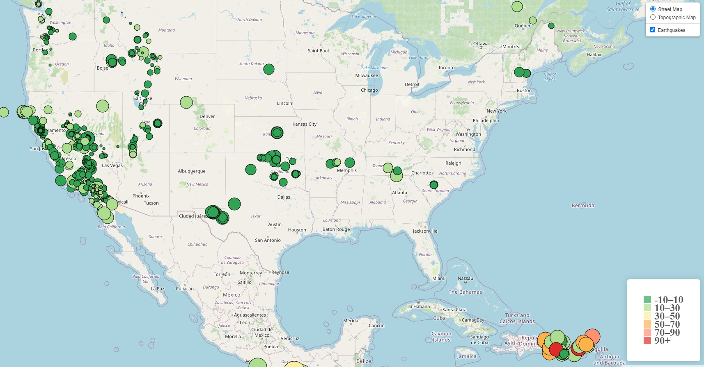
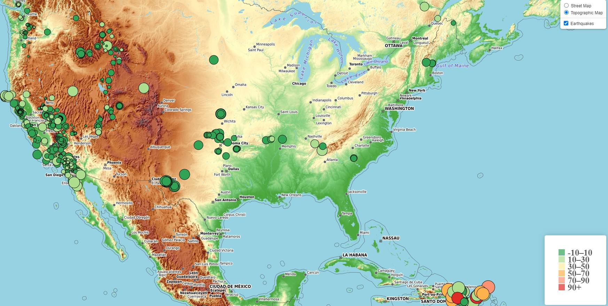

# Leaflet-Homework
In this assignment I created a map using Leaflet that plots all of the earthquakes from our data set based on their longitude and latitude.
Data markers reflect the magnitude of the earthquake by their size and and depth of the earthquake by color. Earthquakes with higher magnitudes appear larger and earthquakes with greater depth should appear darker in color. The map include popups that provide additional information about the earthquake when a marker is clicked. The is also a legend included that provides context to the map. 

The map visualization has two views(streetview and topographic). Screenshots are below:

## Street View:

## Topographic View:

